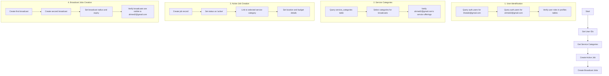

# Job Broadcast Implementation Plan

## Overview
This plan outlines the steps to create job broadcast requests from khatabi@gmail.com that will be visible to ahmed2@gmail.com. The end goal is to have:
- 1 active job for ahmed2@gmail.com
- 2 broadcast jobs from khatabi@gmail.com visible to ahmed2@gmail.com

## Implementation Flow



## Detailed Steps

### 1. Database Investigation

#### User Identification
```sql
-- Get User IDs
SELECT * FROM auth.users WHERE email IN ('khatabi@gmail.com', 'ahmed2@gmail.com');

-- Verify Profiles
SELECT * FROM homeowner_profiles WHERE user_id = :khatabi_id;
SELECT * FROM professional_profiles WHERE user_id = :ahmed2_id;
```

#### Service Categories
```sql
-- Get available service categories
SELECT * FROM service_categories;
```

### 2. Active Job Creation

Required fields:
- homeowner_id (from khatabi@gmail.com)
- service_id
- title
- description
- location details
- budget range
- status = 'active'

```sql
INSERT INTO jobs (
    homeowner_id,
    service_id,
    title,
    description,
    location_address,
    location_lat,
    location_lng,
    budget_range_min,
    budget_range_max,
    status
) VALUES (
    :homeowner_id,
    :service_id,
    :title,
    :description,
    :location_address,
    :location_lat,
    :location_lng,
    :budget_min,
    :budget_max,
    'active'
);
```

### 3. Broadcast Jobs Creation

Required fields for each broadcast:
- homeowner_id (from khatabi@gmail.com)
- service_id (different for each broadcast)
- title
- description
- location details
- budget range
- broadcast_radius
- expiry_time
- status = 'broadcast'

```sql
INSERT INTO job_broadcasts (
    broadcast_id,
    homeowner_id,
    service_id,
    title,
    description,
    location_address,
    location_lat,
    location_lng,
    urgency_level,
    preferred_schedule,
    budget_range_min,
    budget_range_max,
    broadcast_radius,
    status,
    expiry_time
) VALUES (
    gen_random_uuid(),
    :homeowner_id,
    :service_id,
    :title,
    :description,
    :location_address,
    :location_lat,
    :location_lng,
    :urgency_level,
    :preferred_schedule,
    :budget_min,
    :budget_max,
    :broadcast_radius,
    'broadcast',
    NOW() + interval '7 days'
);
```

### 4. Verification Queries

```sql
-- Check active job
SELECT * FROM jobs 
WHERE professional_id = :ahmed2_id 
AND status = 'active';

-- Check broadcast jobs
SELECT * FROM job_broadcasts 
WHERE broadcast_radius >= 
    ST_Distance(
        location_point, 
        (SELECT location_point FROM professional_profiles WHERE user_id = :ahmed2_id)
    )
AND status = 'broadcast'
AND homeowner_id = :khatabi_id;
```

## Next Steps

1. Review and approve the SQL operations
2. Switch to code mode for implementation
3. Execute the operations in the following order:
   - User verification
   - Service category selection
   - Active job creation
   - Broadcast jobs creation
   - Final verification
4. Document any issues or adjustments needed during implementation